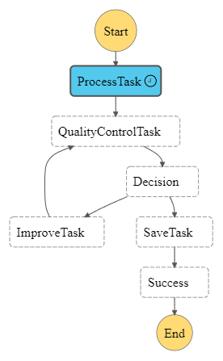

# A sample CDK application to orchestrate OpenAI Function Calling with AWS Lambda and Step Functions

This project demonstrates how to use the AWS CDK to orchestrate OpenAI function calling with AWS Lambda and Step Functions. The project includes a CDK stack that deploys the following resources:
- A Lambda Layer for the OpenAI package
- A SSM Parameter for the OpenAI API key
- A template for a Lambda function that receives prompts and function specifications by environment variables
- A CDK construct for a State Machine that orchestrates the Lambda function
- An output Lambda that writes results to an S3 bucket
- An S3 bucket for storing results



> This is a simplified example for demo purposes that shall showcase the following concepts:
> - How to use the AWS CDK to deploy a Lambda Layer
> - How to use the AWS CDK to deploy a Lambda function
> - How to use the AWS CDK to orchestrate a State Machine with Step Functions and OpenAI

## Remarks

The current OpenAI Function pipeline creates Cloudformation templates from given descriptions. This is a toy example and works well for simple things that can be generated in one go by GPT, eg. 'Write a static website hosting solution' but for more complex things it will loop until timeout without convergence.
The output will be loaded to a created S3 bucket.

## Deployment
First set your OpenAI API key in the OPENAI_API_KEY environment variable. Then the deployment will automatically create a SSM parameter for you that is accessible by the lambdas.  

To deploy the CDK stack, run the following command:
```bash
OPENAI_API_KEY=<your_openai_api_key> cdk deploy --all
```

Then go to the step-functions console and start a new execution of the state machine. You can use the following input:
```json
{
  "input:description": "Write a static website hosting solution",
}
```

You can view the example output that will be uploaded to the S3 bucket for the description above [here](output/example-output.yaml)
